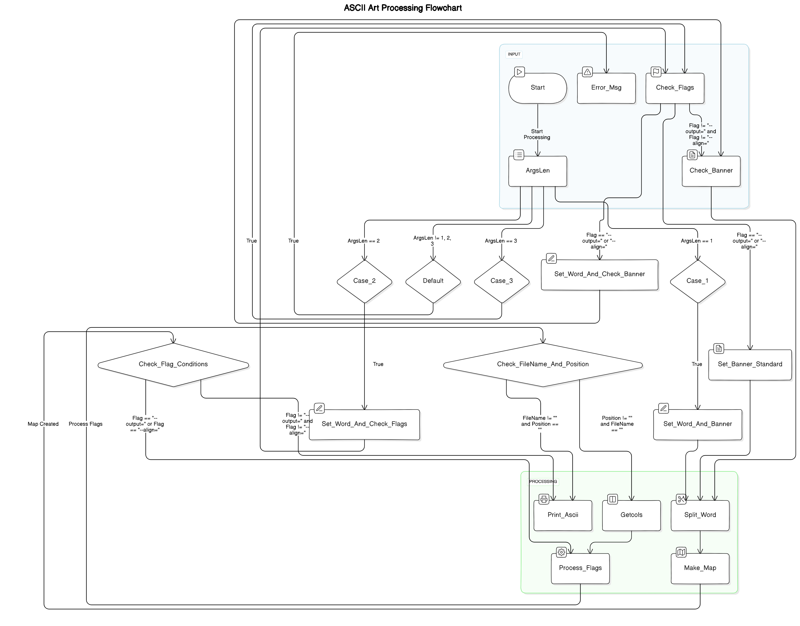

# 📚 Project Documentation

## 📖 Overview
This Go project appears to be a text processing application that transforms input text into ASCII art. It supports different styles of ASCII art, which are defined in text files, and it can output the result to the console or a file.

## 📂 Directory Structure
- `main/`: Contains the main entry point of the application, `main.go`.
- `pkg/`: Contains the packages used by the application.
    - `Ascii/`: Contains the core ASCII art processing logic.
    - `AsciiJustify/`: Contains logic for text justification.
    - `AsciiOutput/`: Contains logic for outputting the ASCII art.
    - `Outil/`: Contains utility functions and structures.
- `static/`: Contains text files defining different styles of ASCII art.

## 🗝️ Key Files
- `main/main.go`: The main entry point of the application.
- `pkg/Ascii/AsciiProcess.go`: Contains the `Process_Text` function, which is the main function for processing the input text into ASCII art.
- `pkg/Ascii/CheckBanner.go`: Contains the `Check_Banner` function, which validates the selected ASCII art style.
- `pkg/Ascii/AsciiMap.go`: Contains the `Make_Map` function, which creates a map of ASCII art characters from the selected style.

## 🚀 Usage
To run the application, execute the `main.go` file with the desired arguments. The first argument is the text to transform into ASCII art. The second argument can be a flag or the name of an ASCII art style (standard, shadow, or thinkertoy). If a flag is provided, the third argument should be the name of the ASCII art style.

## 🏳️ Flags
- `--output=`: Specifies a file to output the ASCII art to.
- `--align=`: Specifies the alignment of the ASCII art (left, center, or right).

## 📊 Diagram

# ASCII Art Processing Flowchart

## Flowchart Explanation

### Start (Terminator)
This is where the process begins.

### Error_Msg (Process)
Outputs an error message if necessary.

### Check_Flags (Process)
Checks the input flags for specific conditions (`--output=`, `--align=`).

### ArgsLen (Decision)
Determines the number of arguments passed to the process.

Possible paths:
- **Case_1 (ArgsLen == 1)**
- **Case_2 (ArgsLen == 2)**
- **Case_3 (ArgsLen == 3)**
- **Default (Other cases)**

### Case_1 (Process)
Sets the banner to a standard configuration when there is only one argument.

### Case_2 (Process)
Invokes `Set_Word_And_Check_Banner` to set the word and verify the banner settings when there are two arguments.

### Case_3 (Process)
Similar to Case_2 but used when there are three arguments.

### Set_Word_And_Check_Banner (Process)
Sets the word and checks the banner conditions based on input flags.

### Check_FileName_And_Position (Decision)
Verifies if the file name and position values are correctly set.

### Set_Word_And_Banner (Process)
Sets both the word and the banner configuration.

### Set_Banner_Standard (Process)
Configures the banner to a standard setup.

### Check_Flag_Conditions (Decision)
Checks specific flag conditions, directing the flow based on flag values.

### Print_Ascii (Process)
Prints the ASCII art to the console or a file.

### Getcols (Process)
Retrieves the column settings for the output.

### Split_Word (Process)
Splits the input word based on specific criteria.

### Make_Map (Process)
Creates a map of the ASCII art.

### Process_Flags (Process)
Processes the input flags and applies them to the ASCII art generation.

### End (Terminator)
Marks the end of the process.

## Flow Overview
- The process starts and checks for any flags. Depending on the number of arguments (ArgsLen), it follows different paths to set the word and banner.
- If specific conditions are met (Check_FileName_And_Position), it proceeds to generate the ASCII art.
- Flags are processed, and the ASCII art is printed or output based on the provided flags.

## 👥 Collaborators
This project was developed in collaboration with:

- [Youssef Hajjaoui](https://github.com/Youssefhajjaoui)
- [Ilyass Atlassi](https://github.com/ilyassatlassi)
- [Ilyass mohamed Foukahi](https://github.com/reg-era)